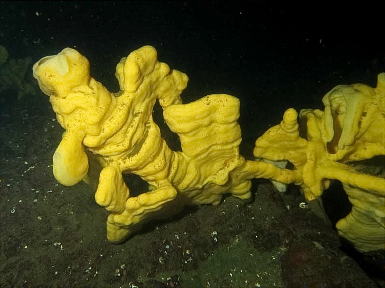

```{r setup, include=FALSE}
knitr::opts_chunk$set(echo = FALSE)
```



## Source of the article with publication date and word count : 

*Source of the article* : [link of article](https://www.sciencedaily.com/releases/2020/06/200604095644.htm)

*Date of the article* : 04/06/2020

*Word count* : ± 700 words 

## Vocabulary : 

| Word from the text :  | Synonym/definition in English :     | French translate :           |
| --------------------- | ----------------------------------- | ---------------------------- |
| Sprawling         | Tentacular   | Tentaculaire      |
| Tremendous    | Huge         | Énorme              |
| To mimic              | To imitate                             | Imiter |
| To starve           | To be hungry                  | Affamer                 |
| To curtail           | To slow down             | Freiner                  |

## Analysis table :

| Basic article information 	| / 	|
|------------------------------	|-------------------------------------------------------------------------------------------------------------------------------------------------------------------------------------------------------------------------------------------------------------------------------------------------------------------------------------------------------------------------------------------------------------------------------------------------------------------------------------------------------------------------------------------------------------------------------------------------------------------------------	|
| Researchers 	| Angela Stevenson (postdoctoral fellow at UBC Zoology) and Jeff Marliave (researcher at the Ocean Wise Research Institute).            	|
| Published in ? 	| Scientific Reports 	|
| General topic ? 	| Impacts of climate change on glass sponge reefs. 	|
| Procedure/what was examined? 	| Angela Stevenson took a species of glass sponge (Aphrocallistes vastus) and she plunged them into waters which correspond to future conditions of oceans. These future conditions are a water warmer and more acidic (due to climate change).    |
| Conclusions/discovery? 	| Results show there are modifications on the capacity of pumping, body condition and skeletal strength of glass sponges. The capacity of pumping and tissues are reduced and, so, the food intake lowers too. Furthermore, the body becomes more elastic and weaker which can lead to reef collapse and to slow down reef formation.  |
| Remaining questions ? 	|  / 	


