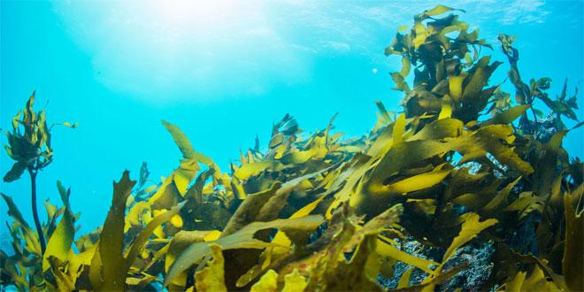

```{r setup, include=FALSE}
knitr::opts_chunk$set(echo = FALSE)
```



## Source of the article with publication date and word count : 

*Source of the article* : [link of article](https://www.sciencedaily.com/releases/2021/01/210115110333.htm)

*Date of the article* : 15/01/2021

*Word count* : ± 470 words 

## Vocabulary : 

| Word from the text :  | Synonym/definition in English :     | French translate :           |
| --------------------- | ----------------------------------- | ---------------------------- |
| To anchor         | Attach something in the water    | Ancrer      |
| Disturbance    | Perturbation         | Perturbation              |
| To seep              | To run slowly                            | Suinter, couler lentemennt |

## Analysis table :

| Basic article information 	| / 	|
|------------------------------	|-------------------------------------------------------------------------------------------------------------------------------------------------------------------------------------------------------------------------------------------------------------------------------------------------------------------------------------------------------------------------------------------------------------------------------------------------------------------------------------------------------------------------------------------------------------------------------------------------------------------------------	|
| Researchers 	| Researchers from the university of Tsukuba in Japan.            	|
| Published in ? 	| In Global Change Biology 	|
| General topic ? 	| Impacts of climate change on Algae. 	|
| Procedure/what was examined? 	| To begin, scientists put tiles into water so that algae can grow on them. They put tiles into two different waters with “normal conditions” (= water not subject to human activity and, thus, without over-acidification) and with acidification conditions (which correspond at conditions of CO2 at the end of 21st century). Then, they watched the differences between the coldest months (i.e., January to July) and the warmest months (i.e., July to January).    |
| Conclusions/discovery? 	| Algae into acidification conditions grow on tiles but with an inferior biodiversity, a lower complexity and a smaller biomass (these results are constant for all of seasons). Scientists decided to exchange algae between the two different conditions. They found that colonies h adapted at the environment where they had transplanted. Thus, Algae which had transplanted into classic water, has returned to a normal biodiversity, complexity and biomass (and vice versa for algae into acidification conditions).  |
| Remaining questions ? 	|  / 	

