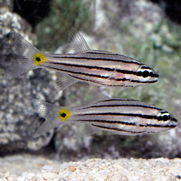

```{r setup, include=FALSE}
knitr::opts_chunk$set(echo = FALSE)
```



## Source of the article with publication date and word count : 

*Source of the article* : [link of article](https://news.nova.edu/news-releases/nsu-researcher-part-of-team-studying-impact-of-rising-sea-temperatures-on-marine-life/)

*Date of the article* : 26/01/2021

*Word count* : ± 600 words 

## Vocabulary : 

| Word from the text :  | Synonym/definition in English :     | French translate :           |
| --------------------- | ----------------------------------- | ---------------------------- |
| Gill         | Organ with which the fish breathes    | Branchie      |

## Analysis table :

| Basic article information 	| / 	|
|------------------------------	|-------------------------------------------------------------------------------------------------------------------------------------------------------------------------------------------------------------------------------------------------------------------------------------------------------------------------------------------------------------------------------------------------------------------------------------------------------------------------------------------------------------------------------------------------------------------------------------------------------------------------------	|
| Researchers 	| Nadler (a doctor in philosophy) and a team of researchers (including Jacob Johansen, a doctor in medicine).            	|
| Published in ? 	| Site of eLife Science journal. 	|
| General topic ? 	| Effects of climate change on fishes. 	|
| Procedure/what was examined? 	| Nadler and the team took two species of fishes: the five-lined cardinalfish and the redbelly yellowtail fusilier. Then, they increased the temperature of fish water by 3 degrees Celsius (above the average summer temperatures) to imitate the heat waves due to climate change.    |
| Conclusions/discovery? 	| The redbelly yellowtail fusilier has rapidly responded by changes in structure and shape of gill. Nevertheless, the five-lined cardinalfish has slowly responded. So, he is more resistant to elevated temperatures. To finish, the researchers has identified seven parameters which can be use like biomarkers. In effect, these parameters can evaluate how fast and to which extent coral reef fishes can resist to the augmentation of temperatures.  |
| Remaining questions ? 	|  / 

