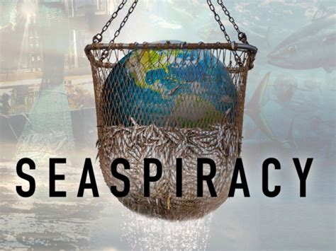

* *October :* This month, I watched a new series in English that a friend recommended me. This is series who talks about a virus in the rain, it is called “The rain”. I loved it and I can’t wait to continue it. Furthermore, I was watched some videos about science. 

* *November :* This month, I loaded a new application about information : that is the BBC News. I find that is an interesting application because we can daily know news of world. For example, I was able to follow the American Election and discover the defeat of Trump. Then, I discovered too a new serie about chess which call "The Gambit of chess". 

* *December and January :* I studied for my exams. So, except working for my exam and watching some video, I did not a lot of thing to improve my English.

* *April :* I watched a very interesting report on Netflix. It's called "Seaspiracy". I'm just going to give you a little teaser because it's really worth watching it entirely. 

Ali is a young English citizen who is passionate about the marine world and, more specifically, about whales. In view of the number of whale beachings in recent years, he decides to take a closer look at the subject of plastic pollution of seas and the future of our oceans. During his research, he noticed that plastic micro-particles are only the tip of the iceberg. Our oceans are really in danger and not necessarily for what we think.

This report allows me to deepen my subject and to notice that global warming is only one harmful factor among many others. Unfortunately, the marine world does not only have to fight global warming. 

